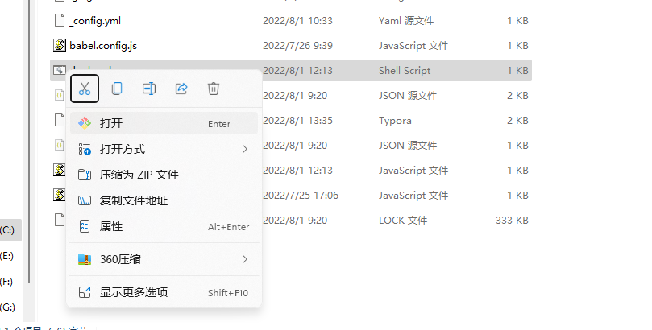
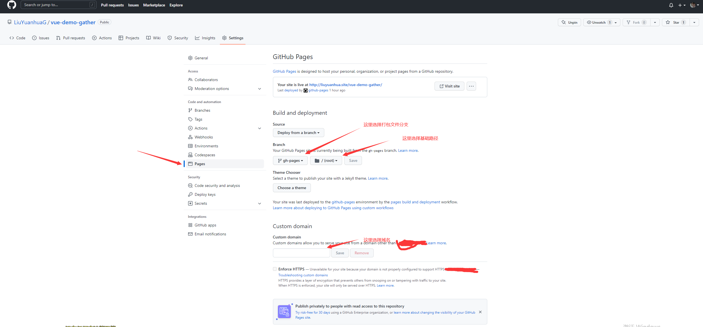

# vue-demo-gather

## 部署

```js
bash deploy.sh
LiuYuanhuaG.github.io/vue-demo-gather
```

yarn serve

```

### Compiles and minifies for production
```

yarn build

```

### Lints and fixes files
```

yarn lint

````

### Customize configuration
See [Configuration Reference](https://cli.vuejs.org/config/).

### 提交规范

https://www.jianshu.com/p/c7e40dab5b05

##### 部署到GitHub

1. 在vue.config.js 文件中配置publicPath

   ```js
   module.exports = {
     publicPath: process.env.NODE_ENV === 'production'
       ? '/my-project/'
       : '/'
   }
````

2. 添加 deploy.sh 文件

   ```sh
   #!/usr/bin/env sh

   # 确保脚本抛出遇到的错误
   set -e

   # 删除旧的文件
   rm -rf dist

   rm -rf ./src/views/.DS_Store

   # 生成新的压缩文件
   yarn build

   # 进入生成的文件夹
   cd dist

   # 复制一个 index.html并命名为 404.html 解决 historyAPI 404问题
   cp index.html 404.html

   # 如果是发布到自定义域名
   # echo 'www.example.com' > CNAME

   git init
   git add -A
   git commit -m 'deploy'

   # 一下都可以使用两种方法 http  ssh（需要配置ssh密匙）
   # 如果发布到 https://<USERNAME>.github.io
   # git push -f git@github.com:<USERNAME>/<USERNAME>.github.io.git master

   # 如果发布到 https://<USERNAME>.github.io/<REPO>
   git push -f https://github.com/LiuYuanhuaG/vue-demo-gather.git master:gh-pages
   cd -
   ```

3. 执行 deploy.sh

   如果在 window 下 则用 git Bash 执行该文件

   

   或者在 git Bash 命令行中键入

   ```
   sh deploy.sh
   ```

4. 在 GitHub 项目 setting 中配置

   
